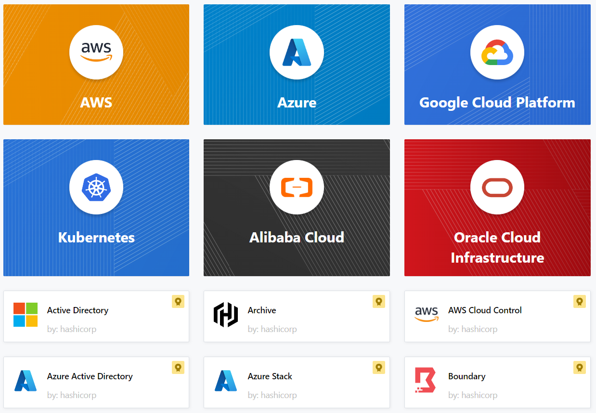

# Terraform Top Level Blocks
- **Terraform Block** (>0.13 version) or Terraform Settings Block or Terraform Configuration Block
- **Provider Block**
- **Resource Block**
- **Input Variables Block**
- **Output Values Block**
- **Local Values Block**
- **Data Sources Block**
- **Modules Block**

### **Terraform Block**

- Terraform block is used to specify various **settings that apply to the entire Terraform project**
- It allows you to **configure global settings** and features.
- Special block used to configure some **behaviors of Terraform** itself
- You define
    - Required **terraform version**
    - **Provider** requirements
    - Configure **terraform state file** (backend)
- Within a terraform block, **only constant values can be used**, arguments may not refer to named objects such as resources, input variables, etc, and may not use any of the Terraform language built-in functions.
- This block is typically defined at the beginning of the Terraform configuration file usually with names like ***backend.tf*** and is enclosed within the ***terraform {}*** syntax
- Example
    ```hcl
    terraform {
    required_version = "~> 0.14.3"
    required_providers {
        aws = {
            source = "hashicorp/aws"
            version = "~> 5.0"
        }
    }
    backend "s3" {
        bucket = "my-tf-state-bucket"
        key    = "path/to/my/key"
    }
    }
    ```
    In this example:

    - **required_version** :
        - Specifies the minimum required version of Terraform for your configuration. You can use version constraints to ensure compatibility.
        - *~> 0.14.3*: Means any version greater than or equal to 0.14.3 but less than the next significant version (0.15.0).
        - more details here : [https://developer.hashicorp.com/terraform/language/expressions/version-constraints](https://developer.hashicorp.com/terraform/language/expressions/version-constraints)

    - **required_providers** :
        - Specifies the provider requirements
        - more details here : [https://registry.terraform.io/providers/hashicorp/aws/latest/docs](https://registry.terraform.io/providers/hashicorp/aws/latest/docs)

    - **backend** :
        - Specifies the backend configuration for remote state storage.
        - In this case, it's configured to use an S3 bucket as the backend, and you provide the bucket name and key.

### **Provider Block**



- The provider block is used to **configure the named provider**, 
    - example : *aws,azure(azurerm), GCP(google), kubernetes*, etc 
- The **Terraform Provider Block** is used to **define and configure the cloud or infrastructure platform to manage resources**
- Providers **act as plugins that enable Terraform to interact with cloud providers APIs**.
- A provider is **responsible for creating and managing resources**. 
- By default, providers are not installed along with terraform (it’s just exe file), but when you run the command '*terraform init*' the plugins for the providers gets downloaded.
- Multiple provider blocks can exist if a Terraform configuration is composed of multiple providers, which is a common situation.


- Example - AWS Provider Block:

    ```hcl
    provider "aws" {
    region = "us-east-1"
    }
    ```
    In this example:
    - **provider**: The **keyword** to start the provider block.
    - **aws**: The **name of the provider**. In this case, it's the AWS provider.
    - **region** = "us-east-1": Configuration parameters for the provider. Here, it **specifies the AWS region** as *us-east-1* and all AWS resources will be configured and managed in this AWS region.
- more details here : 
    - [https://registry.terraform.io/browse/providers](https://registry.terraform.io/browse/providers)
    - [https://www.terraform.io/language/providers](https://www.terraform.io/language/providers )
    - [https://www.terraform.io/docs/providers/index.html](https://www.terraform.io/docs/providers/index.html)
    - [https://registry.terraform.io/browse/providers](https://registry.terraform.io/browse/providers)
