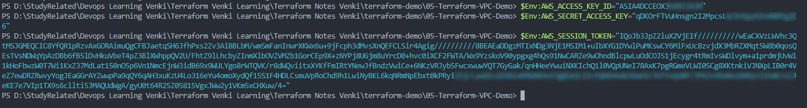

# Terraform VPC Demo
# TO-DO : execute the terraform commands to create VPC using vpc.tf and update the command documentation with screenshots

### Step 01 : Create a file 00_provider.tf file to include terraform and provider block

  ```hcl
  terraform {
    required_providers {
      aws = {
      source = "hashicorp/aws"
      version = "~> 5.0"
      }
    }
  }

  provider "aws" {
      region = "us-east-1"

      default_tags {
        tags = {
          terraform = "yes"
          project = "terraform-learning"
        }
      }
  }
  ```

[00_provider.tf](00_provider.tf)

### Step 02: Create a file 01_vpc.tf to create resource block to create AWS VPC

- [Terraform AWS VPC Resource](https://registry.terraform.io/providers/hashicorp/aws/latest/docs/resources/vpc)

  ```hcl
  resource "aws_vpc" "appvpc" {
      cidr_block = "10.0.0.0/16"

      tags = {
        Name = "myapp-vpc"
      }
  }
  ```

[01_vpc.tf](01_vpc.tf)

### Step 03: Authenticate to AWS via IAM Credentials

- [Terraform AWS Authentication Types](https://registry.terraform.io/providers/hashicorp/aws/latest/docs#authentication) 
    - **Static Credentials** - You can use this under *provider* section, but its NOT A RECOMMENDED Option
    - **Environment variables** - Recommended Option (example below)
    - **IAM credentials** stored locally (configuration file $HOME/.aws/credentials)
      - use *`aws configure`* to configure the aws credentials

- Example : Using **Environment variables** via PowerShell
    - 

### Step 04: Execute Terraform Commands
  
  #### Initialize Terraform
  *`terraform init`*

  #### Validate Terraform Configuration files
  *`terraform validate`*

  #### Execute Terraform Plan
  *`terraform plan`*

  #### Deploy AWS Resources 
  *`terraform apply`*  
  or  
  *`terraform apply -auto-approve`* (if you want to avoid the prompt) NOT Recommended for beginners 

### Step-05: Clean-Up
  #### Destroy Terraform Resources
  *`terraform destroy`*  
  or  
  *`terraform destroy -auto-approve`* (if you want to avoid the prompt) NOT Recommended for beginners

  #### Delete Terraform Files from current directory

  ##### Linux
  *`rm -rf .terraform*`*  
  *`rm -rf terraform.tfstate*`*

  ##### Windows:
  Delete the lock file *.terraform** and state file *terraform.tfstate* files from the folder


## References
- [Terraform Providers](https://www.terraform.io/docs/configuration/providers.html)
- [AWS Provider Documentation](https://registry.terraform.io/providers/hashicorp/aws/latest/docs)
- [Terraform AWS VPC Resource](https://registry.terraform.io/providers/hashicorp/aws/latest/docs/resources/vpc)