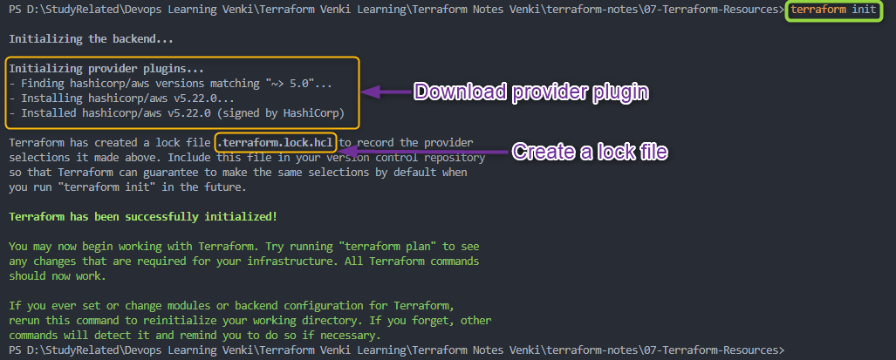

# Terraform Resource

## Terraform Resource Block

- A **Terraform Resource** is a fundamental unit used to model and manage infrastructure components. 

- Each resource block describes one or more ***infrastructure objects*** that you want to create, modify, or manage.
    - Example :  ***s3 bucket***, ***ec2 instance***, ***RDS instance***, ***Security Group***, ***VPC***

- [**resource Syntax**](https://developer.hashicorp.com/terraform/language/resources/syntax)
    ```hcl
    resource "type" "name" {
        argument1 = "value1"
        argument2 = "value2"
        ......... = "......"
        ......... = "......"
        argumentn = "valuen"
    }
    ```

- **Example of a Resource Block:**

    ```hcl
    resource "aws_instance" "example" {
    ami           = "ami-0c55b159cbfafe1f0"
    instance_type = "t2.micro"
    
    tags = {
    Name = "Linux"
    }

    }
    ```
    

    - **`resource`:** The keyword to start a ***resource*** block.
    - **`aws_instance`:** 
        - The **resource type**, which defines what you're creating (e.g., an AWS EC2 instance).
        - Resource type determines the kind of infrastructure object it manages and what arguments and other attributes the resource supports
    - **`example`**:
        - The **resource name**, which is a unique identifier within your configuration.
        - Its a Local name ("example"). 
        - The name is used to refer to this resource from elsewhere in the same Terraform module, but has no significance outside that module's scope.
    - **`ami`, `instance_type` and `tags`:** Arguments or the Configuration parameters specific to the resource you're defining.


## Terraform Resource Behaviors

Terraform resource behaviors refer to,
- How Terraform manages and interacts with resources in your infrastructure. 
- These behaviors determine how resources are
    - ***created***
    - ***updated***
    - ***destroyed***

1. ***Create*** :
   - Terraform attempts to **create resources** in your target infrastructure based on your configuration.
   - Terraform ***creates* resources** that exist in the configuration but are not associated(present) with a real infrastructure object in the state

2. ***Destroy*** :
   - ***Destroys* resources** that exist in the state/infra but no longer exist in the configuration.
   - Removing a resource from your Terraform configuration leads to the planned destruction of that resource in the infrastructure.

3. ***Update in-place*** :
   - ***update* the resources** whose arguments have changed
   - Terraform detects differences between the desired state in your configuration and the current state in the infrastructure. It plans and applies changes to update resources accordingly.

4. ***Destroy and re-create*** :
   - Terraform will ***destroy and re-create* resources** whose arguments have changed but which cannot be updated in-place due to remote API limitations
   - Example : Changing Availability zone of an AWS EC2 instance


5. ***Dependency Management*** :
   - Terraform ensures dependent resources are created or updated before resources that rely on them to avoid issues.

6. ***Concurrency Control*** :
   - Terraform manages resource operation concurrency to prevent conflicts and ensure consistency.

7. ***State Management*** :
   - Terraform maintains a state file that records the current state of the infrastructure, which is used to plan and apply updates.

### Understanding Terraform Resource Behavior with Example
- Lets Create an AWS EC2 instance and understand Terraform Resource(EC2) Behavior

    1. Create Terraform **provider** block
        ```hcl
        terraform {
        required_providers {
            aws = {
                source = "hashicorp/aws"
                version = "~-> 5.0"
            }
        }
        }

        provider "aws" {
            region = "us-east-1"

            default_tags {
                tags = {
                terraform = "yes"
                project = "terraform-learning"
                }
            }  
        }
        ```
    2. Create **Resource (EC2)** block

        ```hcl
        resource "aws_instance" "example" {
        ami           = "ami-0df435f331839b2d6"
        instance_type = "t2.micro"

        tags = {
            Name = "Linux2023"
            Owner = "Venkatesh"
        }
        }
        ```

- Execute Terraform commands to understand resource behavior

    1. Initialize terraform  
        - ***`terraform init`***
         
        - On executing initialization terraform downloads the plugin for provider (in our case AWS) under ***.terraform*** folder in the current directory
         

        - Terraform also creates lock file named ***".terraform.lock.hcl"***
         

    2. Validate terraform code
        - ***`terraform validate`***
        - **Validate the configuration files** in a directory
        - Validate runs checks that verify whether a configuration is **syntactically valid and internally consistent**
        - Primarily useful for general verification of reusable modules, including correctness of attribute names and value types.
        - It is safe to run this command automatically
        - Validation **requires an initialized working directory** (*terraform init*) with any referenced plugins and modules installed
        - Example : 
            - terraform validate with error statements to correct
            
             - In above case, *resource* should be *`aws_instance`* and not *`aws_ec2`* hence *`terraform validate`* will show an error           
            - terraform validate with no errors
            

    3. format terraform code
        - ***`terraform fmt`***
    4. Review the terraform plan
        - ***`terraform plan`***
    5. Create Resources by terraform
        - ***`terraform apply`***


### References :
- [https://developer.hashicorp.com/terraform/language/resources/syntax](https://developer.hashicorp.com/terraform/language/resources/syntax)
- [https://developer.hashicorp.com/terraform/language/resources/behavior](https://developer.hashicorp.com/terraform/language/resources/behavior)