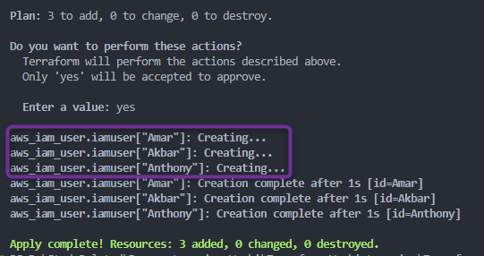
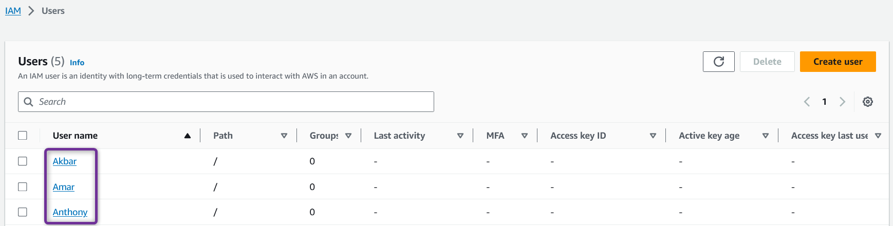

##  Terraform Resource Meta-Arguments

2. ### ***`for_each`*** Meta Argument

- **Example**:  ***`set`***  

    [00_provider.tf](./00_provider.tf)
    ```hcl
    terraform {
    required_providers {
        aws = {
            source = "hashicorp/aws"
            version = "~> 5.0" 
        }
    }
    }

    provider "aws" {
        region = "us-east-1"

        default_tags {
        tags = {
            Terraform = "yes"
            Project = "terraform-learning"
        }
        }
    }
    ```
        
    [01_iam.tf](./01_iam.tf)
    ```hcl
    # Create 3 IAM Users using single resource block
    # https://registry.terraform.io/providers/hashicorp/aws/latest/docs/resources/iam_user

    resource "aws_iam_user" "iamuser" {
    for_each = toset(["Amar", "Akbar", "Anthony", "Amar"]) # Though user Amar is defined twice, set would remove duplicate
    name     = each.key

    tags = {
        Name = each.key
        # Name = each.value # when using set , each.key == each.value , so you can use either key or value.
    }
    }

    # above can also be written using map

    # resource "aws_iam_user" "iamuser" {
    #   for_each = {
    #     Amar  = null
    #     Akbar  = null
    #     Anthony  = null
    #   }

    #   name = each.key

    #   tags = {
    #     Name = each.key
    #   }
    # }
    ```

- Lets Execute Terraform commands to understand resource behavior

    1. ***`terraform init`*** : *Initialize* terraform
    2. ***`terraform validate`*** : *Validate* terraform code
    3. ***`terraform fmt`*** : *format* terraform code
    4. ***`terraform plan`*** : *Review* the terraform plan
    5. ***`terraform apply`*** : *Create* Resources by terraform
        
        

        - Once terraform completes the execution you should be able to check on your AWS console resources successfully created.
            
 
    6. ***`terraform destroy`*** : *destroy or delete* Resources, Cleanup the resources we created
        - After you type ***yes*** to *`terraform destroy`* prompt, terraform will start **destroying** resources

        - Once terraform completes the execution you should be able to check on your AWS console resources successfully deleted.