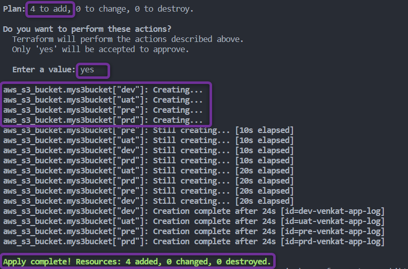
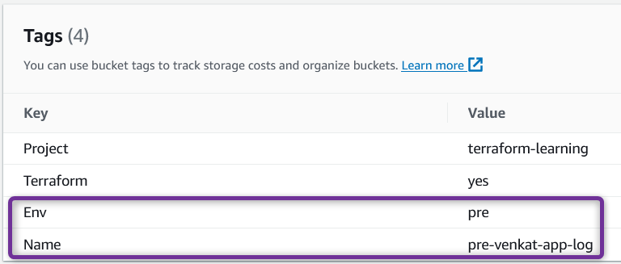
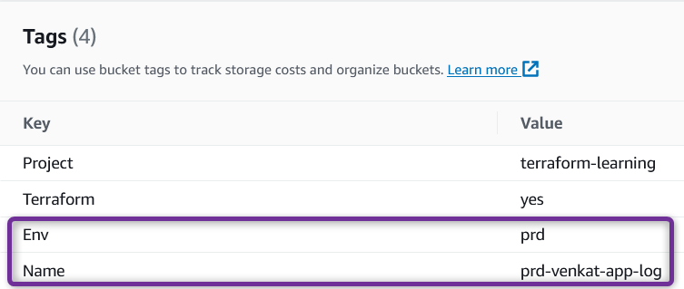
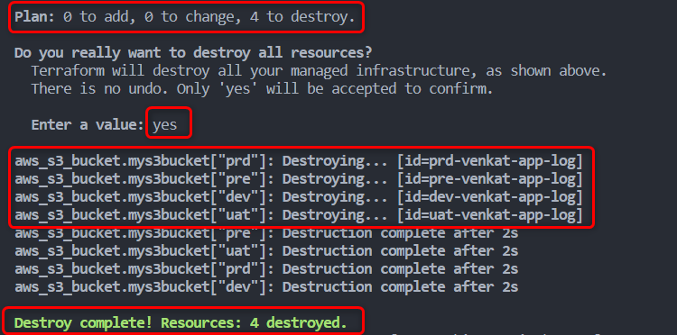

##  Terraform Resource Meta-Arguments

2. ### ***`for_each`*** Meta Argument

    - The ***for_each*** Meta Argument is used to **create multiple instances of a resource based on the elements of a ***`map`*** or ***`set`*****. 
    - ***for_each*** provides flexibility for **managing resources with different configurations**.
    - When you define a resource block with the *for_each* Meta Argument, you can provide a *`map`* or *`set`* that describes the configuration for each resource instance. 
    - Terraform will then create a **separate resource for each element in the map or set**
   
    - ***`map`***
        - A ***map*** is a data structure that stores ***`key-value pairs`***. 
        - **Each key in the map is unique**, and **it's associated with a specific value**
        - Example:
            ```hcl
            {
                Venkatesh : "98869-12345",
                Suresh    : "98450-56789",
                Ramesh    : "94480-54321"
            }
            ```
            - You have names (keys) and phone numbers (values). Each name (key) is associated with a specific phone number (value).
            - **Keys in a map are unique**, You **can't have two entries with the same key**. 

    - ***`set`***
        - A *set* is data structure that **stores a collection of distinct elements**. 
        - In a *set*, **there are no duplicates**, and the **order of elements doesn't matter**.
        - Sets **automatically ensure uniqueness**. If you add an element that already exists, it won't be duplicated.
        - Example:
            ```hcl
            {"Venkatesh", "Suresh", "Ramesh", "Venkatesh"}
            ```
            - Though "Venkatesh" is defined 2 times , set considers it to be only one , it wont be duplicated.

    - **Note** : A **given resource or module block cannot use both ***count***** and ***for_each*** .

    - **Example**:  ***`map`***
    [00_provider.tf](./00_provider.tf)
        ```hcl
        terraform {
        required_providers {
            aws = {
                source = "hashicorp/aws"
                version = "~> 5.0" 
            }
        }
        }

        provider "aws" {
            region = "us-east-1"

            default_tags {
            tags = {
                Terraform = "yes"
                Project = "terraform-learning"
            }
            }
        }
        ```

    [01_s3.tf](./01_s3.tf)
        ```hcl
        resource "aws_s3_bucket" "mys3bucket" {
            for_each = {
                dev = "venkat-app-log"
                uat = "venkat-app-log"
                pre = "venkat-app-log"
                prd = "venkat-app-log"
            }
            bucket = "${each.key}-${each-value}"

            tags = {
            Name = "${each.key}-${each.value}"
            Env = "${each.key}"
            }
        }
        ```

- Lets Execute Terraform commands to understand resource behavior

    1. ***`terraform init`*** : *Initialize* terraform
    2. ***`terraform validate`*** : *Validate* terraform code
    3. ***`terraform fmt`*** : *format* terraform code
    4. ***`terraform plan`*** : *Review* the terraform plan
    5. ***`terraform apply`*** : *Create* Resources by terraform
        - Example of *`terraform apply`*
            
            
            
            

        - After you type ***yes*** to *`terraform apply`* prompt, terraform will start **creating** resources.
            

        - Once terraform completes the execution you should be able to check on your AWS Console four S3 buckets created successfully
            

        - Each bucket is tagged with respect to its ***Env value***
            
            
            
            

 
    6. ***`terraform destroy`*** : *destroy or delete* Resources, Cleanup the resources we created
        - After you type ***yes*** to *`terraform destroy`* prompt, terraform will start **destroying** resources

        


        - Once terraform completes the execution you should be able to check on your AWS Console both S3 buckets are successfully deleted.
        

