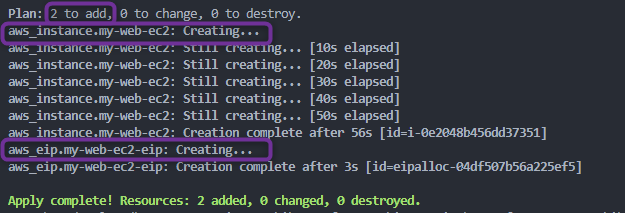
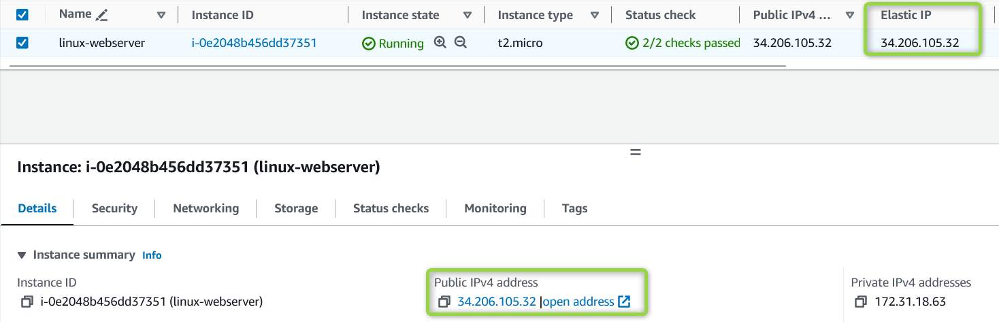
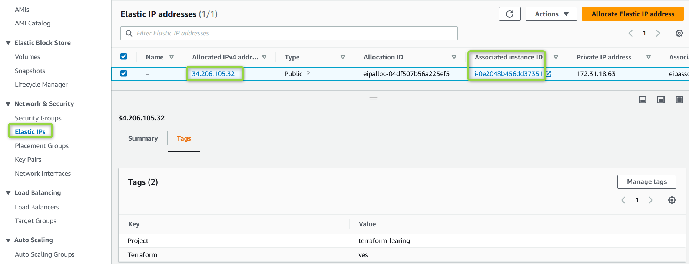

## Terraform Meta Argument: *`depends_on`*

### ***`depends_on`*** Meta Argument

- The ***depends_on*** Meta Argument in Terraform is used to **establish ***explicit*** dependencies between resources**, specifying that one resource **depends on the successful creation or modification of another resource**.

- When you set *`depends_on`* for a resource, you indicate that **this resource should only be created or modified after the resources listed in *`depends_on`* are successfully created or modified**.
- This is particularly useful when you have resources that rely on the completion of certain tasks before they can proceed.
    
- **Example**: You can use `depends_on` to ensure that *elastic ip* is assigned to a EC2 web server only after EC2 is created.
        1. Create *00_provider.tf* for providers
        2. Create an AWS EC2 instance using the *aws_instance* resource block.
        3. Create an AWS Elastic IP using the *aws_eip* resource block.
        4. Use the *`depends_on`* Meta Argument in the Elastic IP resource to specify that it should only be associated with the EC2 instance once that instance has been created. This ensures that the Elastic IP is associated with a valid EC2 instance.

    [00_provider.tf](./00_provider.tf)
    ```hcl
    terraform {
    required_version = "~> 1.0"
    required_providers {
        aws = {
        source  = "hashicorp/aws"
        version = "~> 5.0"
        }
    }
    }

    provider "aws" {
    region = "us-east-1"
    default_tags {
        tags = {
        Terraform = "yes"
        Project   = "terraform-learning"
        }
    }
    }
    ```

    [01_ec2.tf](./01_ec2.tf)
    ```hcl
    resource "aws_instance" "my-web-ec2" {
    ami           = "ami-0df435f331839b2d6"
    instance_type = "t2.micro"

    tags = {
        Name  = "linux-webserver"
        Owner = "Venkatesh"
    }
    }
    ```

    [02_eip.tf](./02_eip.tf)
    ```hcl
    # Resource: aws_eip
    # https://registry.terraform.io/providers/hashicorp/aws/latest/docs/resources/eip

    resource "aws_eip" "my-web-ec2-eip" {
    instance   = aws_instance.my-web-ec2.id
    depends_on = [aws_instance.my-web-ec2]
    }
    ```


- Lets Execute Terraform commands to understand resource behavior

    1. ***`terraform init`*** : *Initialize* terraform
    2. ***`terraform validate`*** : *Validate* terraform code
    3. ***`terraform fmt`*** : *format* terraform code
    4. ***`terraform plan`*** : *Review* the terraform plan
    5. ***`terraform apply`*** : *Create* Resources by terraform
        

    - Once terraform completes the execution you should be able to check on your AWS console resources successfully created.
        
        


    #### Cleanup 
 
    6. ***`terraform destroy`*** : *destroy or delete* Resources, Cleanup the resources we created
        - After you type ***yes*** to *`terraform destroy`* prompt, terraform will start **destroying** resources

        - Once terraform completes the execution you should be able to check on your AWS console resources successfully deleted.

### References :

[Resource: aws_eip](https://registry.terraform.io/providers/hashicorp/aws/latest/docs/resources/eip)  
[The depends_on Meta-Argument](https://developer.hashicorp.com/terraform/language/meta-arguments/depends_on)