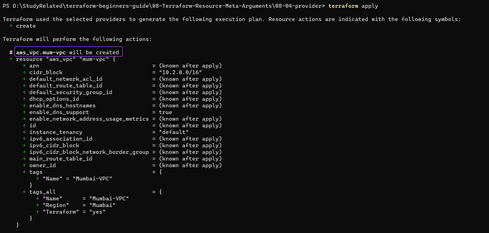
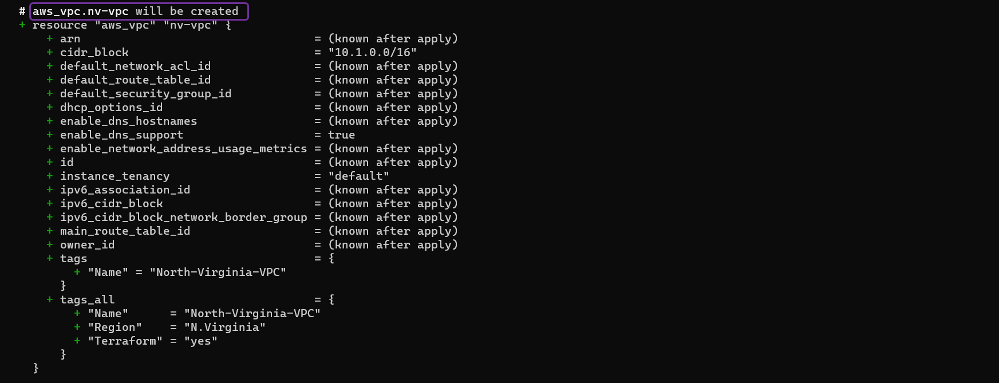
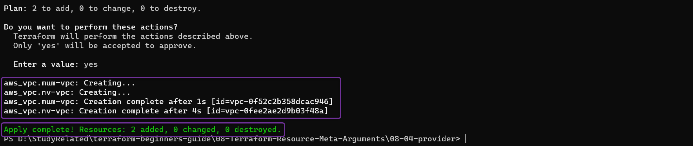
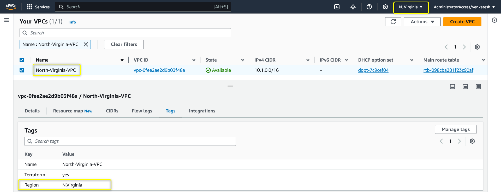
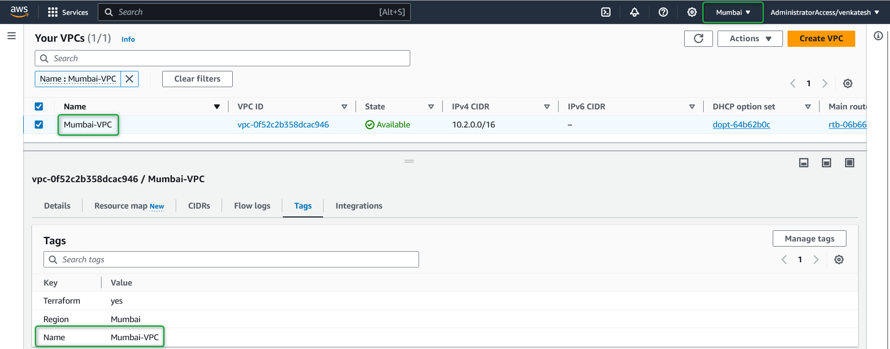

## Terraform Meta Argument: *`provider`*

### ***`provider`*** Meta Argument

- *`provider`* helps you to Use Multiple Providers in Terraform
- You can use multiple providers within the same configuration to **manage resources in different cloud regions or service providers**. 
- Each provider definition specifies a different set of configuration parameters, enabling you to interact with multiple environments.

- **Scenario**: Suppose a user wants to use two different AWS regions to launch EC2 instances.

- **Example**:  

    [00_provider.tf](./00_provider.tf)

    ```hcl
    terraform {
    required_version = "~> 1.0"
    required_providers {
        aws = {
        source  = "hashicorp/aws"
        version = "~> 5.0"
        }
    }
    }

    # Define First AWS Provider (us-east-1)
    provider "aws" {
    region = "us-east-1"
    alias  = "us-east-nv"

    default_tags {
        tags = {
        Terraform = "yes"
        Region    = "N.Virginia"
        }
    }
    }

    # Defining Second AWS Provider (ap-south-1)
    provider "aws" {
    region = "ap-south-1"
    alias  = "ap-south-mumbai"

    default_tags {
        tags = {
        Terraform = "yes"
        Region    = "Mumbai"
        }
    }
    }
    ```

    [01_vpc.tf](./01_vpc.tf)

- Lets Execute Terraform commands to understand resource behavior

    1. ***`terraform init`*** : *Initialize* terraform
    2. ***`terraform validate`*** : *Validate* terraform code
    3. ***`terraform fmt`*** : *format* terraform code
    4. ***`terraform plan`*** : *Review* the terraform plan
    5. ***`terraform apply`*** : *Create* Resources by terraform
        - Example of *`terraform apply`*
            
            

        - After you type ***yes*** to *`terraform apply`* prompt, terraform will start **creating** resources.
            

        - Once terraform completes the execution you should be able to check on your AWS Console four S3 buckets created successfully
        - VPC in **`us-east-1`**
            

        - VPC in **`ap-south-1`**
            


    #### Cleanup 
 
    6. ***`terraform destroy`*** : *destroy or delete* Resources, Cleanup the resources we created
        - After you type ***yes*** to *`terraform destroy`* prompt, terraform will start **destroying** resources


        - Once terraform completes the execution you should be able to check on your AWS Console 

### References :

[The Resource provider Meta-Argument](https://developer.hashicorp.com/terraform/language/meta-arguments/resource-provider)
