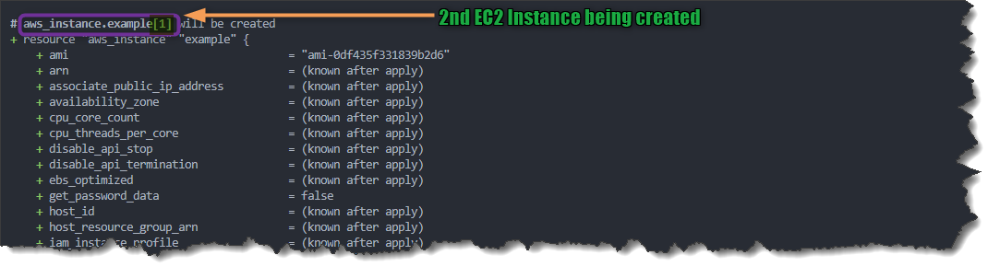
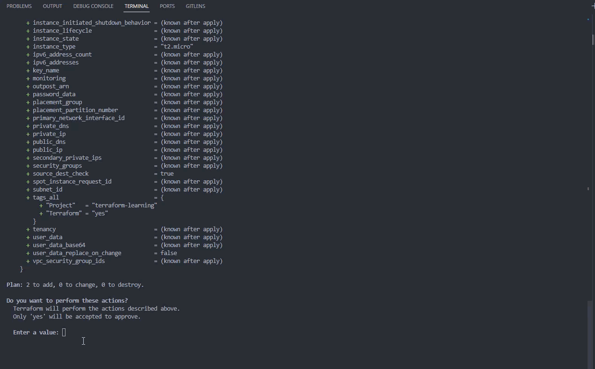
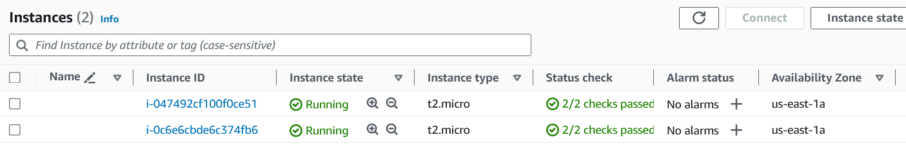
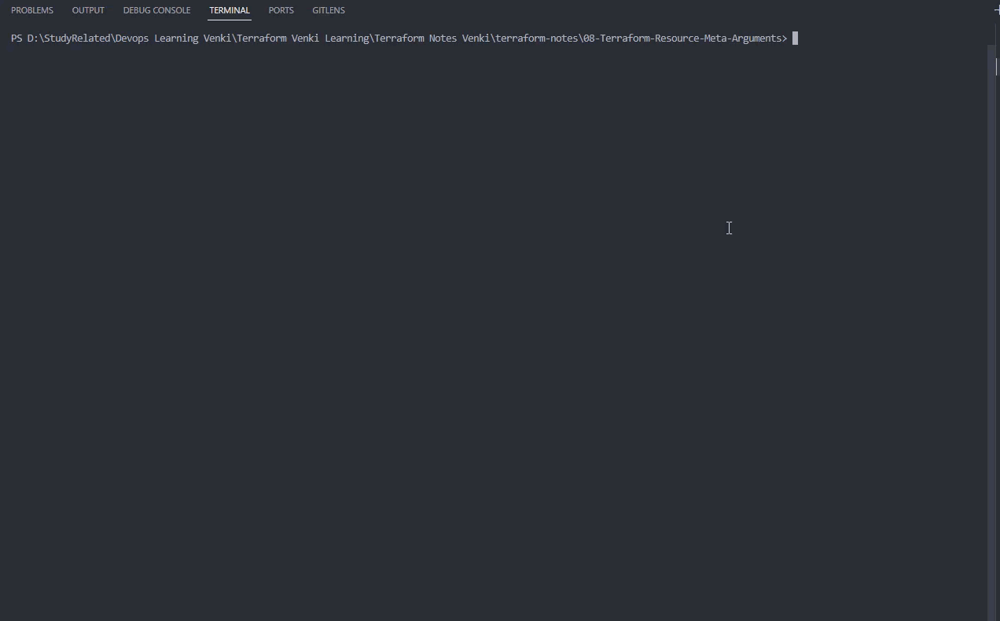
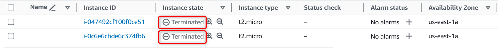

# Terraform Resource Meta-Arguments

## Terraform Meta Arguments

- Meta Arguments are **special configuration settings used to customize how Terraform manages resources**.
- Terraform Meta Arguments **provide additional instructions and behaviors for how Terraform should manage resources**. 
- Terraform Meta Arguments are used to **customize and fine-tune** the behavior of your infrastructure provisioning.

### List of Terraform Meta Arguments

1. ***`count`***
2. ***`depends_on`***
3. ***`for_each`***
4. ***`provider`***
5. ***`lifecycle`***  
<!-- -->

1. ### ***`count`*** Meta Argument

    - The ***count*** Meta Argument allows you to **specify the number of instances of a resource you want to create**. 
    - ***count*** is used when you **need multiple identical resources with the same configuration**.
    - ***count*** can be used with **modules** and with **every resource type**
    - The ***count*** argument **must be a non-negative whole number**. 
    - If ***count*** is **set to 0**, it **will not create any instances of the resource**. 
    - You can also **use expressions** to determine the count dynamically.
    - When each instance is created, it has its own distinct infrastructure object associated with it, so **each can be managed separately**. When the configuration is applied, each object can be created, destroyed, or updated as appropriate.
    - **Note** : A **given resource or module block cannot use both ***count***** and ***for_each*** .

- **Example**:  
    [00_provider.tf](./00_provider.tf)
    ```hcl
    terraform {
    required_providers {
        aws = {
            source = "hashicorp/aws"
            version = "~> 5.0" 
        }
    }
    }

    provider "aws" {
        region = "us-east-1"

        default_tags {
        tags = {
            Terraform = "yes"
            Project = "terraform-learning"
        }
        }
    }
    ```

    [01_ec2.tf](./01_ec2.tf)
    ```hcl
    resource "aws_instance" "example" {
        count = 2 # Using Meta argument to create 2 identical EC2 Instances
        ami           = "ami-0df435f331839b2d6"
        instance_type = "t2.micro"
    }
    ```

- Lets Execute Terraform commands to understand resource behavior

    1. ***`terraform init`*** : *Initialize* terraform
    2. ***`terraform validate`*** : *Validate* terraform code
    3. ***`terraform fmt`*** : *format* terraform code
    4. ***`terraform plan`*** : *Review* the terraform plan
    5. ***`terraform apply`*** : *Create* Resources by terraform
        - Example of *`terraform apply`*
            
            

        - After you type ***yes*** to *`terraform apply`* prompt, terraform will start **creating** resources.
            
            

        - Once terraform completes the execution you should be able to check on your AWS Console 2 EC2 Instance created successfully
            
 
    6. ***`terraform destroy`*** : *destroy or delete* Resources, Cleanup the resources we created
        - After you type ***yes*** to *`terraform destroy`* prompt, terraform will start **destroying** resources

        
        


        - Once terraform completes the execution you should be able to check on your AWS Console both EC2 successfully terminated.
        