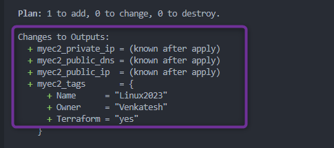
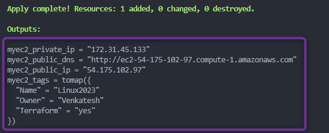
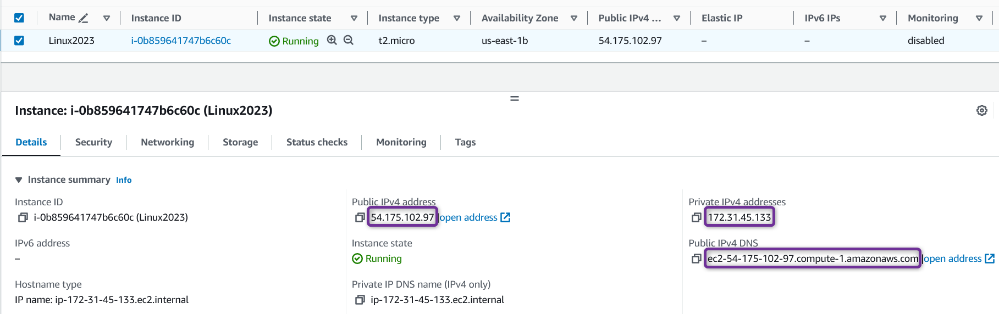
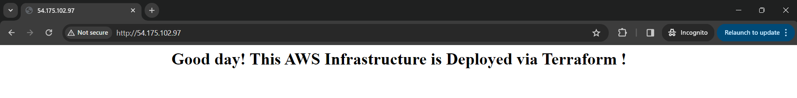

## Terraform Outputs

- In Terraform, outputs allow you to **expose information about your deployed infrastructure**.
- Outputs are useful for **obtaining information about your infrastructure that you might need later**.
- Output values **can be used as input for other Terraform configurations or scripts**.
- Outputs are also helpful for **sharing information with your team or external processes**.
- You **can define multiple outputs** in a single Terraform configuration to get different pieces of information.
- Outputs are handy when you need to **know details about your infrastructure, like IP addresses, instance IDs, or DNS names**.
- You can use an ***`output`*** block to specify what information you want to extract.

**Syntax**:

```hcl
output "local_name" {
value = resource_type.resource_name.attribute_or_argument
}
```

**Example**:  

[00_provider.tf](./00_provider.tf)

```hcl
terraform {
  required_providers {
    aws = {
      source  = "hashicorp/aws"
      version = "~> 5.0"
    }
  }
}

provider "aws" {
  region = var.aws_region

  default_tags {
    tags = {
      Terraform = "yes"
      Owner     = var.owner
    }
  }
}
```

[01_ec2.tf](./01_ec2.tf)

```hcl
resource "aws_instance" "myec2" {
  ami           = var.ec2_ami
  instance_type = var.ec2_instance_type
  user_data     = <<EOF
  #!/bin/bash
  sudo yum update -y
  sudo yum install httpd -y
  sudo systemctl enable httpd
  sudo systemctl start httpd
  echo "<html><body><div><h1><center> Good day! This AWS Infrastructure is Deployed via Terraform ! </center></h1></div></body></html>" | sudo tee /var/www/html/index
  EOF

  tags = {
    Name = "Linux2023"
  }
}
```

[02_variables.tf](./02_variables.tf)

```hcl
variable "aws_region" {
  description = "AWS Region In Which Resources will be Created"
  type        = string
  default     = "us-east-1"
}

variable "owner" {
  description = "Name of the Engineer who is creating Resources"
  type        = string
  default     = "Venkatesh"
}

variable "ec2_ami" {
  description = "AWS EC2 AMI Amazon Linux 2023"
  type        = string
  default     = "ami-0df435f331839b2d6" # Amazon Linux 2023
}

variable "ec2_instance_type" {
  description = "EC2 Instance Type"
  type        = string
  default     = "t2.micro"
}
```

[03_outputs.tf](./03_outputs.tf)

```hcl
output "myec2_public_ip" {
  description = "EC2 Instance Public IP"
  value       = aws_instance.myec2.public_ip
}

output "myec2_private_ip" {
  description = "EC2 Instance Private IP"
  value       = aws_instance.myec2.private_ip
}

output "myec2_tags" {
  description = "EC2 Instance Tags"
  value       = aws_instance.myec2.tags
}

output "myec2_public_dns" {
  description = "Public DNS"
  value       = "http://${aws_instance.myec2.public_dns}"
}
```

- In the above example, We've defined four Outputs that will be displayed during *`terraform plan`* or *`terraform apply`* :   
    1\. `myec2_public_ip`: EC2 Instance Public IP    
    2\. `myec2_private_ip`: EC2 Instance Private IP  
    3\. `myec2_tags`: EC2 Instance Tags  
    4\. `myec2_public_dns`: Public DNS of EC2 Instance   

- Lets Execute Terraform commands to understand resource behavior

    1. ***`terraform init`*** : *Initialize* terraform
    2. ***`terraform validate`*** : *Validate* terraform code
    3. ***`terraform fmt`*** : *format* terraform code
    4. ***`terraform plan`*** : *Review* the terraform plan
    5. ***`terraform apply`*** : *Create* Resources by terraform
       - Example of *`terraform plan`*
       - Plan output shows the some outputs values to be known after apply
            
       
       - Example of *`terraform apply`*
       - terraform apply output shows the outputs values defined under ***`output`*** blocks
       - You can notice `myec2_private_ip` and `myec2_public_dns`, `myec2_public_ip` and `myec2_tags` output being displayed after `terraform apply` is run  

            


    <details> 
    <summary> <i>terraform apply</i> </summary>

    ```hcl
    $ terraform apply

    Terraform used the selected providers to generate the following execution plan. Resource actions are indicated with the following symbols:
    + create

    Terraform will perform the following actions:

    # aws_instance.myec2 will be created
    + resource "aws_instance" "myec2" {
        + ami                                  = "ami-0df435f331839b2d6"
        + arn                                  = (known after apply)
        + associate_public_ip_address          = (known after apply)
        + availability_zone                    = (known after apply)
        + cpu_core_count                       = (known after apply)
        + cpu_threads_per_core                 = (known after apply)
        + disable_api_stop                     = (known after apply)
        + disable_api_termination              = (known after apply)
        + ebs_optimized                        = (known after apply)
        + get_password_data                    = false
        + host_id                              = (known after apply)
        + host_resource_group_arn              = (known after apply)
        + iam_instance_profile                 = (known after apply)
        + id                                   = (known after apply)
        + instance_initiated_shutdown_behavior = (known after apply)
        + instance_lifecycle                   = (known after apply)
        + instance_state                       = (known after apply)
        + instance_type                        = "t2.micro"
        + ipv6_address_count                   = (known after apply)
        + ipv6_addresses                       = (known after apply)
        + key_name                             = (known after apply)
        + monitoring                           = (known after apply)
        + outpost_arn                          = (known after apply)
        + password_data                        = (known after apply)
        + placement_group                      = (known after apply)
        + placement_partition_number           = (known after apply)
        + primary_network_interface_id         = (known after apply)
        + private_dns                          = (known after apply)
        + private_ip                           = (known after apply)
        + public_dns                           = (known after apply)
        + public_ip                            = (known after apply)
        + secondary_private_ips                = (known after apply)
        + security_groups                      = (known after apply)
        + source_dest_check                    = true
        + spot_instance_request_id             = (known after apply)
        + subnet_id                            = (known after apply)
        + tags                                 = {
            + "Name" = "Linux2023"
            }
        + tags_all                             = {
            + "Name"      = "Linux2023"
            + "Owner"     = "Venkatesh"
            + "Terraform" = "yes"
            }
        + tenancy                              = (known after apply)
        + user_data                            = "ac8b3be3af4efb32d5b9f2a6791b777944ae8ce6"
        + user_data_base64                     = (known after apply)
        + user_data_replace_on_change          = false
        + vpc_security_group_ids               = (known after apply)
        }

    Plan: 1 to add, 0 to change, 0 to destroy.

    Changes to Outputs:
    + myec2_private_ip = (known after apply)
    + myec2_public_dns = (known after apply)
    + myec2_public_ip  = (known after apply)
    + myec2_tags       = {
        + Name      = "Linux2023"
        + Owner     = "Venkatesh"
        + Terraform = "yes"
        }

    Do you want to perform these actions?
    Terraform will perform the actions described above.
    Only 'yes' will be accepted to approve.

    Enter a value: yes

    aws_instance.myec2: Creating...
    aws_instance.myec2: Still creating... [10s elapsed]
    aws_instance.myec2: Still creating... [20s elapsed]
    aws_instance.myec2: Still creating... [30s elapsed]
    aws_instance.myec2: Creation complete after 36s [id=i-0b859641747b6c60c]

    Apply complete! Resources: 1 added, 0 changed, 0 destroyed.

    Outputs:

    myec2_private_ip = "172.31.45.133"
    myec2_public_dns = "http://ec2-54-175-102-97.compute-1.amazonaws.com"
    myec2_public_ip = "54.175.102.97"
    myec2_tags = tomap({
    "Name" = "Linux2023"
    "Owner" = "Venkatesh"
    "Terraform" = "yes"
    })
    ```
    </details>

AWS Console 

 

  


## References : 

[Output Values](https://developer.hashicorp.com/terraform/language/values/outputs)
