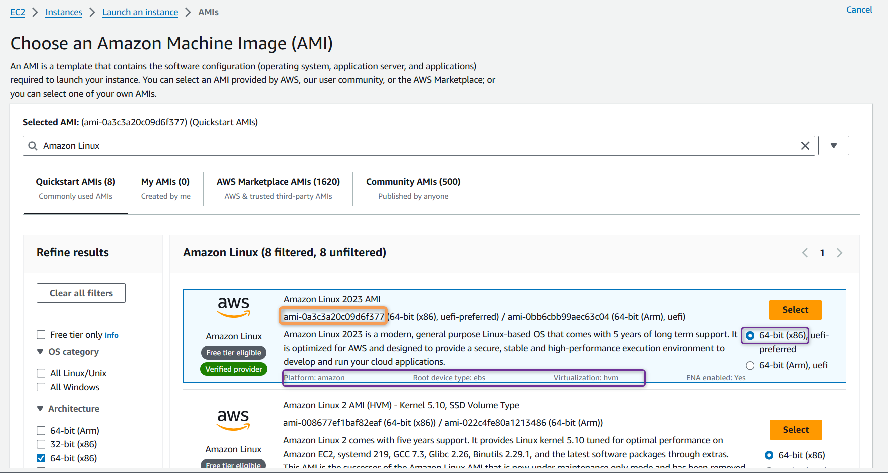
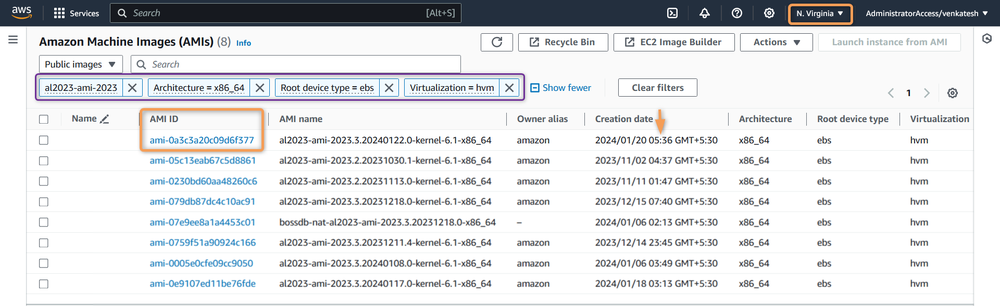
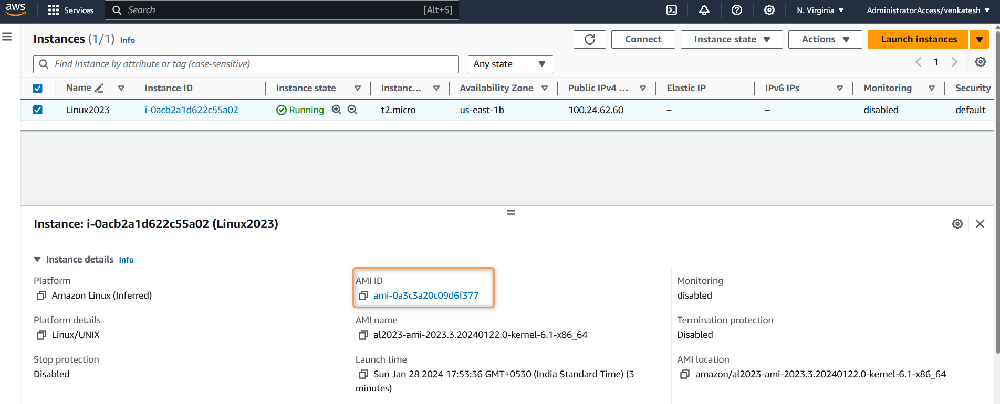

# Terraform Data Sources

## Data Sources
- Data resources in Terraform allow you to **fetch information** or **query existing resources outside of the configuration**

- Data resources **do not create or manage infrastructure**. They provide a **way to reference external data**

- **Immutable Data:** Data resources provide a way to interact with external data, but they **don't modify that data**. **They are read-only**.

- **Data Blocks:** The structure of a data block is similar to a resource block, but with the **`data`** keyword.

- **Dynamic Values:** You can use dynamic values from data resources in various places within your Terraform configuration.

**Syntax**:

```hcl
data "type" "name" {
	argument1 = "value1"
	argument2 = "value2"
	......... = "......"
	
	filter {
	name = "<name>"
	values = "<value>"
	}
	
	filter {
	name = "<name>"
	values = "<value>"
	}
}
```

**Example**:  

[00_provider.tf](./00_provider.tf)

```hcl
terraform {
  required_providers {
    aws = {
      source  = "hashicorp/aws"
      version = "~> 5.0"
    }
  }
}

provider "aws" {
  region = var.aws_region

  default_tags {
    tags = {
      Terraform = "yes"
      Owner     = var.owner
    }
  }
}
```

[01_ec2.tf](./01_ec2.tf)

```hcl
resource "aws_instance" "myec2" {
  ami = data.aws_ami.amzn_linux_2023_latest.id # fetching Latest Amazon Linux AMI id from data sources
  instance_type = var.ec2_instance_type

  tags = {
    Name = "Linux2023"
  }
}
```

[02_variables.tf](./02_variables.tf)

```hcl
variable "aws_region" {
  description = "AWS Region In Which Resources will be Created"
  type        = string
  default     = "us-east-1"
}

variable "owner" {
  description = "Name of the Engineer who is creating Resources"
  type        = string
  default     = "Venkatesh"
}

# AMI section we are going to use data resources to fetch latest Amazon Linux AMI
/*variable "ec2_ami" {
  description = "AWS EC2 AMI Amazon Linux 2023"
  type        = string
  default     = "ami-0df435f331839b2d6" # Amazon Linux 2023
}*/

variable "ec2_instance_type" {
  description = "EC2 Instance Type"
  type        = string
  default     = "t2.micro"
}
```

[03_data.tf](./03_data.tf)

```hcl
data "aws_ami" "amzn_linux_2023_latest" {
    most_recent = true
    owners = [ "amazon" ]

    filter {
      name = "name"
      values = [ "al2023-ami-2023*" ]
    }

    filter {
      name = "architecture"
      values = [ "x86_64" ]
    }

    filter {
      name = "root-device-type"
      values = [ "ebs" ]
    }

    filter {
      name = "virtualization-type"
      values = [ "hvm" ]
    }
}
```

- In the above example, We are trying to fetch Latest AWS EC2 Amazon Linux 2023 AMI (located in us-east-1) based on following filters  

    1\. `most_recent` = `true`, to fetch *latest* AMI  
    2\. `name` = `al2023-ami-2023*` to fetch AMI name starting with *al2023-ami-2023*  
    3\. `architecture` = `x86_64` to fetch AMI of type *x86_64*   
    4\. `root-device-type` = `ebs` to fetch AMI of root device type *ebs*
    5\. `virtualization-type` = `hvm` to fetch AMI of virtualization type *hvm* 

- Filtering with similar pattern on AWS Console you should see,

    AWS launch Console:
          
        
    AWS Public AMI Console (EC2 Page ==> AMI):
        

 - For additional filter type, Please ref to AWS [AWS CLI describe-images](http://docs.aws.amazon.com/cli/latest/reference/ec2/describe-images.html)


- Lets Execute Terraform commands to understand data source behavior

    1. ***`terraform init`*** : *Initialize* terraform
    2. ***`terraform validate`*** : *Validate* terraform code
    3. ***`terraform fmt`*** : *format* terraform code
    4. ***`terraform plan`*** : *Review* the terraform plan
    5. ***`terraform apply`*** : *Create* Resources by terraform
       - Example of *`terraform plan`* or *`terraform apply`*
       - Plan output shows the Latest AWS EC2 Amazon Linux 2023 AMI-ID
            

    <details> 
    <summary> <i>terraform apply</i> </summary>

    ```hcl
    $ terraform apply
    data.aws_ami.amzn_linux_2023_latest: Reading...
    data.aws_ami.amzn_linux_2023_latest: Read complete after 1s [id=ami-0a3c3a20c09d6f377]

    Terraform used the selected providers to generate the following execution
    plan. Resource actions are indicated with the following symbols:
    + create

    Terraform will perform the following actions:

    # aws_instance.myec2 will be created
    + resource "aws_instance" "myec2" {
        + ami                                  = "ami-0a3c3a20c09d6f377"
        + arn                                  = (known after apply)
        + associate_public_ip_address          = (known after apply)
        + availability_zone                    = (known after apply)
        + cpu_core_count                       = (known after apply)
        + cpu_threads_per_core                 = (known after apply)
        + disable_api_stop                     = (known after apply)
        + disable_api_termination              = (known after apply)
        + ebs_optimized                        = (known after apply)
        + get_password_data                    = false
        + host_id                              = (known after apply)
        + host_resource_group_arn              = (known after apply)
        + iam_instance_profile                 = (known after apply)
        + id                                   = (known after apply)
        + instance_initiated_shutdown_behavior = (known after apply)
        + instance_lifecycle                   = (known after apply)
        + instance_state                       = (known after apply)
        + instance_type                        = "t2.micro"
        + ipv6_address_count                   = (known after apply)
        + ipv6_addresses                       = (known after apply)
        + key_name                             = (known after apply)
        + monitoring                           = (known after apply)
        + outpost_arn                          = (known after apply)
        + password_data                        = (known after apply)
        + placement_group                      = (known after apply)
        + placement_partition_number           = (known after apply)
        + primary_network_interface_id         = (known after apply)
        + private_dns                          = (known after apply)
        + private_ip                           = (known after apply)
        + public_dns                           = (known after apply)
        + public_ip                            = (known after apply)
        + secondary_private_ips                = (known after apply)
        + security_groups                      = (known after apply)
        + source_dest_check                    = true
        + spot_instance_request_id             = (known after apply)
        + subnet_id                            = (known after apply)
        + tags                                 = {
            + "Name" = "Linux2023"
            }
        + tags_all                             = {
            + "Name"      = "Linux2023"
            + "Owner"     = "Venkatesh"
            + "Terraform" = "yes"
            }
        + tenancy                              = (known after apply)
        + user_data                            = (known after apply)
        + user_data_base64                     = (known after apply)
        + user_data_replace_on_change          = false
        + vpc_security_group_ids               = (known after apply)
        }

    Plan: 1 to add, 0 to change, 0 to destroy.

    Do you want to perform these actions?
    Terraform will perform the actions described above.
    Only 'yes' will be accepted to approve.

    Enter a value: yes

    aws_instance.myec2: Creating...
    aws_instance.myec2: Still creating... [10s elapsed]
    aws_instance.myec2: Still creating... [20s elapsed]
    aws_instance.myec2: Creation complete after 25s [id=i-0acb2a1d622c55a02]

    Apply complete! Resources: 1 added, 0 changed, 0 destroyed.

    Venkatesh@LenovoPC MINGW64 /d/StudyRelated/terraform-beginners-guide/11-Terraform-Data-Sources (main)

    ```
    </details>

 - You can now find AWS Console the EC2 instance created using Latest AWS EC2 Amazon Linux 2023 AMI

    

## References : 

[Data Sources](https://developer.hashicorp.com/terraform/language/data-sources)

[Data Source: aws_ami](https://registry.terraform.io/providers/hashicorp/aws/latest/docs/data-sources/ami)

[AWS CLI describe-images](http://docs.aws.amazon.com/cli/latest/reference/ec2/describe-images.html)


