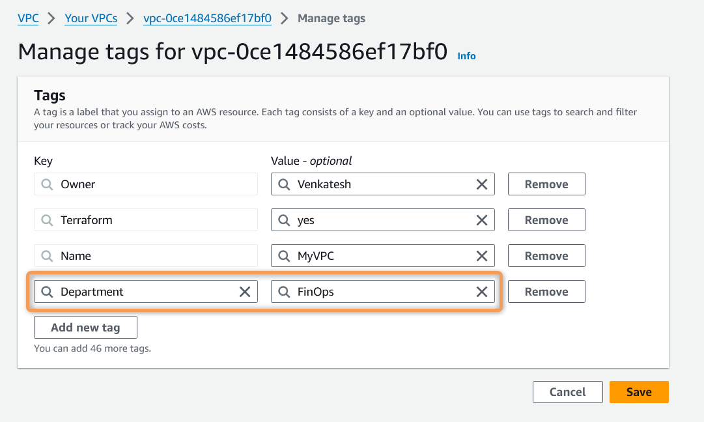

# Terraform Refresh

## Terraform *`refresh`* command

- The *`terraform refresh`* command is used to **update the state file of your terraform project (desired state) with the real-world infrastructure (current state)**. 
- When you run *`terraform refresh`* command, Terraform **queries the actual state** of your infrastructure and **compares it with the state file** that it maintains locally or remotely.
-  The *`terraform refresh`* command **synchronizes the Terraform state with the real-world state of your infrastructure**.

### What happens when you run *`terraform refresh`* command ?

1. **Queries Infrastructure**: Terraform communicates with the provider (e.g., AWS, Azure) to retrieve the current state of all resources defined in your configuration.

2. **Compares with State File**: It compares the current state of the infrastructure with the state stored in the state file.

3. **Updates State File**: Any differences found between the real-world infrastructure and the state file are updated in the state file.

4. **Doesn't Modify Infrastructure**: Unlike `terraform apply`, `terraform refresh` **only updates the state file** and **does not make any changes** to the actual infrastructure.

### When to use *`terraform refresh`* command

- **After External Changes**: Use *`terraform refresh`* when you suspect that changes have been made to your infrastructure outside of Terraform.

- **Before Applying Changes**: It's often a good idea to run *`terraform refresh`* before terraform apply to ensure that your Terraform configuration is based on the most up-to-date information


**Example**: 
- Lets Create A Simple VPC and learn about `terraform refresh` command


[00_provider.tf](./00_provider.tf)

```hcl
terraform {
  required_providers {
    aws = {
      source  = "hashicorp/aws"
      version = "~> 5.0"
    }
  }
}

provider "aws" {
  region = var.aws_region

  default_tags {
    tags = {
      Terraform = "yes"
      Owner     = var.owner
    }
  }
}
```

[01_backend.tf](./01_backend.tf)

```hcl
terraform {
  backend "s3" {
    bucket         = "tf-aws-backend"
    key            = "tf/dev/terraform.tfstate"
    region         = "us-east-1"
    dynamodb_table = "tf-dev-state-lock"
  }
}
```

[02_variables.tf](./02_variables.tf)

```hcl
variable "aws_region" {
  description = "AWS Region In Which Resources will be Created"
  type        = string
  default     = "us-east-1"
}

variable "owner" {
  description = "Name of the Engineer who is creating Resources"
  type        = string
  default     = "Venkatesh"
}

```

[03_vpc.tf](./03_vpc.tf)

```hcl
resource "aws_vpc" "myvpc" {
  cidr_block = "10.0.0.0/16"

  tags = {
    Name = "MyVPC"
  }
}
```

- In the above example, 
    - We are trying to Create A Simple VPC via terraform
    - Manually add additional tag `Department = FinOps` to VPC from AWS Console
    - Observe the behavior w.r.t terraform refresh  

- Lets Execute Terraform commands to understand data source behavior

    1. ***`terraform init`*** : *Initialize* terraform
    2. ***`terraform validate`*** : *Validate* terraform code
    3. ***`terraform fmt`*** : *format* terraform code
    4. ***`terraform plan`*** : *Review* the terraform plan
    5. ***`terraform apply`*** : *Create* Resources by terraform  


  <details> 
  <summary> <i>terraform apply</i> </summary>
    
    ```hcl
    PS D:\StudyRelated\terraform-beginners-guide\14-Terraform-Refresh> terraform apply -auto-approve
    Acquiring state lock. This may take a few moments...

    Terraform used the selected providers to generate the following execution plan. Resource actions are indicated with the following symbols:
    + create

    Terraform will perform the following actions:

    # aws_vpc.myvpc will be created
    + resource "aws_vpc" "myvpc" {
        + arn                                  = (known after apply)
        + cidr_block                           = "10.0.0.0/16"
        + default_network_acl_id               = (known after apply)
        + default_route_table_id               = (known after apply)
        + default_security_group_id            = (known after apply)
        + dhcp_options_id                      = (known after apply)
        + enable_dns_hostnames                 = (known after apply)
        + enable_dns_support                   = true
        + enable_network_address_usage_metrics = (known after apply)
        + id                                   = (known after apply)
        + instance_tenancy                     = "default"
        + ipv6_association_id                  = (known after apply)
        + ipv6_cidr_block                      = (known after apply)
        + ipv6_cidr_block_network_border_group = (known after apply)
        + main_route_table_id                  = (known after apply)
        + owner_id                             = (known after apply)
        + tags                                 = {
            + "Name" = "MyVPC"
            }
        + tags_all                             = {
            + "Name"      = "MyVPC"
            + "Owner"     = "Venkatesh"
            + "Terraform" = "yes"
            }
        }

    Plan: 1 to add, 0 to change, 0 to destroy.
    aws_vpc.myvpc: Creating...
    aws_vpc.myvpc: Creation complete after 3s [id=vpc-0ce1484586ef17bf0]
    Releasing state lock. This may take a few moments...

    Apply complete! Resources: 1 added, 0 changed, 0 destroyed.
    ```
  </details>

- You can now find AWS Console the VPC with CIDR 10.0.0.0/16 created. Now lets Manually add additional tag `Department = FinOps` and than run terraform plan to see how terraform detects the change and implies to remove the manual changes.

    


- ***`terraform plan`*** : Detects the change and implies to remove the manual changes

      

  <details> 
  <summary> <i>terraform plan</i> </summary>
    
    ```hcl
    PS D:\StudyRelated\terraform-beginners-guide\14-Terraform-Refresh> terraform plan
    Acquiring state lock. This may take a few moments...
    aws_vpc.myvpc: Refreshing state... [id=vpc-0ce1484586ef17bf0]

    Terraform used the selected providers to generate the following execution plan. Resource actions are indicated with the following symbols:
    ~ update in-place

    Terraform will perform the following actions:

    # aws_vpc.myvpc will be updated in-place
    ~ resource "aws_vpc" "myvpc" {
            id                                   = "vpc-0ce1484586ef17bf0"
        ~ tags                                 = {
            - "Department" = "FinOps" -> null
                "Name"       = "MyVPC"
            }
        ~ tags_all                             = {
            - "Department" = "FinOps" -> null
                # (3 unchanged elements hidden)
            }
            # (14 unchanged attributes hidden)
        }

    Plan: 0 to add, 1 to change, 0 to destroy.
    ```
  </details>

- Now lets run *`terraform refresh`* command to synchronize real infra (current state) with terraform tf files (desired state)

    ```hcl
        PS D:\StudyRelated\terraform-beginners-guide\14-Terraform-Refresh> terraform refresh
        Acquiring state lock. This may take a few moments...
        aws_vpc.myvpc: Refreshing state... [id=vpc-0ce1484586ef17bf0]
        Releasing state lock. This may take a few moments...
        PS D:\StudyRelated\terraform-beginners-guide\14-Terraform-Refresh>        
    ```
- Now lets run *`terraform show`* command to see the new tag `Department = FinOps` updated to terraform state file

    ```hcl
    PS D:\StudyRelated\terraform-beginners-guide\14-Terraform-Refresh> terraform show
    # aws_vpc.myvpc:
    resource "aws_vpc" "myvpc" {
        arn                                  = "arn:aws:ec2:us-east-1:520974589522:vpc/vpc-0ce1484586ef17bf0"
        assign_generated_ipv6_cidr_block     = false
        cidr_block                           = "10.0.0.0/16"
        default_network_acl_id               = "acl-008d6f0c48dbb7170"
        default_route_table_id               = "rtb-09b93a8f5486a6f76"
        default_security_group_id            = "sg-0418ad85d2ece013a"
        dhcp_options_id                      = "dopt-7c9cef04"
        enable_dns_hostnames                 = false
        enable_dns_support                   = true
        enable_network_address_usage_metrics = false
        id                                   = "vpc-0ce1484586ef17bf0"
        instance_tenancy                     = "default"
        ipv6_netmask_length                  = 0
        main_route_table_id                  = "rtb-09b93a8f5486a6f76"
        owner_id                             = "520974589522"
        tags                                 = {
            "Department" = "FinOps"
            "Name"       = "MyVPC"
        }
        tags_all                             = {
            "Department" = "FinOps"
            "Name"       = "MyVPC"
            "Owner"      = "Venkatesh"
            "Terraform"  = "yes"
        }
    }        
    ```

- **Please Note** : 
    - *`terraform refresh`* command **only updates the state file** and **does not really import the new changes to existing code**.
    - If you want to include the new changes into the code as well than you will have to update the code manually as well.

- ***`terraform plan`*** : Would still detects the change and implies to remove the manual changes, running *`terraform apply`* will certainly remove any manual changes into infra. 

    ```hcl
    PS D:\StudyRelated\terraform-beginners-guide\14-Terraform-Refresh> terraform plan
    Acquiring state lock. This may take a few moments...
    aws_vpc.myvpc: Refreshing state... [id=vpc-0ce1484586ef17bf0]

    Terraform used the selected providers to generate the following execution plan. Resource actions are indicated with the following symbols:
    ~ update in-place

    Terraform will perform the following actions:

    # aws_vpc.myvpc will be updated in-place
    ~ resource "aws_vpc" "myvpc" {
            id                                   = "vpc-0ce1484586ef17bf0"
        ~ tags                                 = {
            - "Department" = "FinOps" -> null
                "Name"       = "MyVPC"
            }
        ~ tags_all                             = {
            - "Department" = "FinOps" -> null
                # (3 unchanged elements hidden)
            }
            # (14 unchanged attributes hidden)
        }

    Plan: 0 to add, 1 to change, 0 to destroy.
    ```

- So to conclude, if you have any manual changes to your AWS infrastructure than you have 2 Choices to make  

    1\. If you **do not want the manual changes**, you can run *`terraform apply`* and it will certainly remove any manual changes into infra. 
    
    2\. If you **want to retain the manual changes**, than you will have to update your terraform code as well to incorporate the same changes.

    Example : Lets update new tag `Department = FinOps` to our *03_vpc.tf* file and run *`terraform plan`* again 

    ```hcl
    resource "aws_vpc" "myvpc" {
    cidr_block = "10.0.0.0/16"

    tags = {
        Name = "MyVPC"
        Department = "FinOps"
    }
    }
    ```
- ***`terraform plan`*** : now shows there is ***No changes. Your infrastructure matches the configuration***.

    ```hcl
    PS D:\StudyRelated\terraform-beginners-guide\14-Terraform-Refresh> terraform plan
    Acquiring state lock. This may take a few moments...
    aws_vpc.myvpc: Refreshing state... [id=vpc-0ce1484586ef17bf0]

    No changes. Your infrastructure matches the configuration.

    Terraform has compared your real infrastructure against your configuration and found no differences, so no changes are needed.
    Releasing state lock. This may take a few moments...
    ```

## References : 

Terraform Refresh : https://developer.hashicorp.com/terraform/cli/commands/refresh

<!-- Terraform Refresh : [https://developer.hashicorp.com/terraform/cli/commands/refresh](https://developer.hashicorp.com/terraform/cli/commands/refresh) -->


