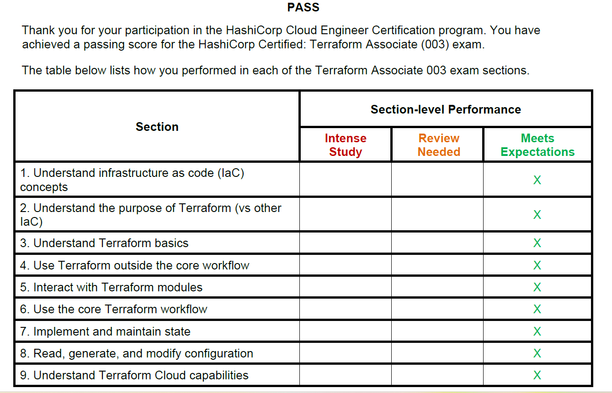

# Terraform Beginners Guide

  

<!--   -->

- ### [00-Terraform-Basics](00-Terraform-Basics) - Terraform Definitions and more
- ### [01-Terraform-Installation](01-Terraform-Installation) - Install Terraform

- ### [02-Terraform-Configuration](01-Terraform-Configuration) - Configure Terraform

- ### [03-Terraform-Terminologies](03-Terraform-Terminologies)

    - **Provider** : Define the providers like AWS, Azure, GCP
    - **Resource** : Infrastructure Resources to be created, ex: VPC, S3, EC2
    - **Data Sources** (optional) : Pull the data from the provider
    - **Variable**: Give user option to enter the value for defined resources
    - **Arguments** : Inputs
    - **Attributes** : Outputs
    - **Meta-Arguments** : Terraform specific Inputs ex: count, for_each,depends_on

- ### [04-Terraform-Top-Level-Blocks](04-Terraform-Top-Level-Blocks) - Terraform Top Level Blocks
    - **Terraform Block** (>0.13 version) or Terraform Settings Block or Terraform Configuration Block 
    - **Provider Block**
    - **Resource Block**
    - **Input Variables Block**
    - **Output Values Block**
    - **Local Values Block**
    - **Data Sources Block**
    - **Modules Block**


- ### [05-Terraform-Commands](05-Terraform-Commands) - Basic Terraform Commands
    - *`terraform init`*
    - *`terraform validate`*
    - *`terraform plan`*
    - *`terraform apply`* or *`terraform apply -auto-approve`*
    - *`terraform destroy`* or *`terraform destroy -auto-approve`*

- ### [06-Terraform-VPC-Demo](06-Terraform-VPC-Demo) - Simple Demo to Create AWS VPC using Terraform

- ### [07-Terraform-Resources](07-Terraform-Resources) - Understanding Resource behavior
    - ***created***
    - ***destroyed*** 
    - ***updated***

- ### [08-Terraform-Resource-Meta-Arguments](08-Terraform-Resource-Meta-Arguments) - Terraform Meta-Arguments
    1. [***`count`***](08-Terraform-Resource-Meta-Arguments/08-01-count/)
    2. [***`for_each`***](08-Terraform-Resource-Meta-Arguments/08-02-for_each/) 
    3. [***`depends_on`***](08-Terraform-Resource-Meta-Arguments/08-03-depends_on/)
    4. [***`provider`***](08-Terraform-Resource-Meta-Arguments/08-04-provider/) 
    5. [***`lifecycle`***](08-Terraform-Resource-Meta-Arguments/08-05-lifecycle/)

- ### [09-Terraform-Variables](09-Terraform-Variables) - Terraform Variables
    1. [**Terraform Variables with `default` Option**](09-Terraform-Variables/)
    2. [**Overriding `default` Variable values with `-var` Option**](09-Terraform-Variables/)
    3. [**Overriding `default` Variable values with `Environment Variables` Options**](09-Terraform-Variables/)
    4. [**Overriding `default` Variable values with `terraform.tfvars` file**](09-Terraform-Variables/09-01-Terraform-Variables-tfvars/)
    5. [**Overriding `default` Variable values with different `.tfvars` using *`-var-file`* Option**](09-Terraform-Variables/09-02-Terraform-Variables-tfvars-var-file/)
    6. [**Terraform Variables type *list***](09-Terraform-Variables/09-03-Terraform-Variables-list/)
    7. [**Terraform Variables type *map***](09-Terraform-Variables/09-04-Terraform-Variables-map/)
    8. [**Custom Validation Rules**](/09-Terraform-Variables/09-05-Custom-Validation-Rules/)
    9. [**Sensitive Variables**](/09-Terraform-Variables/09-06-Sensitive-Variables/)

- ### [10-Terraform-Outputs](10-Terraform-Outputs) - Terraform Output Values

- ### [11-Terraform-Data-Sources](11-Terraform-Data-Sources) - Terraform Data Sources

- ### [12-Terraform-State](12-Terraform-State) - Terraform State

- ### [13-Terraform-Show](13-Terraform-Show) - Terraform Show (need to update)

- ### [14-Terraform-Refresh](14-Terraform-Refresh) - Terraform Refresh Desired and Current state sync

- ### [15-Terraform-State-Commands](15-Terraform-State-Commands) - Inspect, Modify, and Manage the Terraform state

- ### [16-Terraform-Workspaces](16-Terraform-Workspaces) - Manage multiple sets of infrastructure (dev, uat, pre, and prd) with the same Terraform configuration

- ### [17-Terraform-Modules](17-Terraform-Modules) - Reusable terraform codes

- ### [18-Terraform-Import](18-Terraform-Import) - Bring Existing Infrastructure Under IaC

- ### [19-Terraform-Debug](19-Terraform-Debug) - Debugging Terraform

- ### [20-Terraform-Exam-Cheat-Sheet](20-Terraform-Exam-Cheat-Sheet) - Cheat Sheet for Terraform Certification

- ### [99-Terraform-Example-Codes](99-Terraform-Example-Codes) - Sample Terraform codes for more practice

<!--
    - [Simple EC2 Creation](99-Terraform-Example-Codes/01-ec2-creation/)
    - [Simple EC2 Creation Using Data Blocks](99-Terraform-Example-Codes/01.1-ec2-creation-data-blocks/)
    - [S3 Static Website Hosting](99-Terraform-Example-Codes/02-s3-static-website/)
    - [S3 Static Website Hosting multi Env](99-Terraform-Example-Codes/02.1-s3-static-website-env/)

-->

- #### Pending Notes
    - 02-Terraform-Configuration
    - 04-Terraform-Top-Level-Blocks
        - Multiple Providers ( covered in meta argument provider)
     - 05-Terraform-Commands
     - 06-Terraform-VPC-Demo
        - execute the terraform commands to create VPC using vpc.tf and update the command documentation with screenshots     
     - 07-Terraform-Resources
        - Terraform resource behavior for  in place update (add tag) destroy and recreate (change AZ)
    - 08-Terraform-Resource-Meta-Arguments
        - *for_each* for set creating iam user notes
    - 11-Terraform-local-values
    - 13-Terraform-Show
    - 17-Terraform-Modules
        - add some examples
    - 18-Terraform-Import
        - add some examples

## Project Work and Example Codes

1. [Simple EC2 Creation](99-Terraform-Example-Codes/01-ec2-creation/)
2. [Simple EC2 Creation Using Data Blocks](99-Terraform-Example-Codes/01.1-ec2-creation-data-blocks/)

3. [Static Website Using S3](99-Terraform-Example-Codes/02-s3-static-website)

4. [Static Website Using S3 Multi Env](99-Terraform-Example-Codes/02.1-s3-static-website-env)

5. Create Simple Web Server (TBD)
    - AWS Components
        - EC2
        - Security Group to allow port 22
        - Security Group to allow port 80, 443
    - Use Terraform variables where ever possible.

## HashiCorp Certified: Terraform Associate (003)

- If you are planning to get certified, Please find below Online course that can help you to prepare and clear the Exams

- Choose any course or author you feel connected and follow along to complete entire playlist or the course to master terraform

- Please note below mentioned course list is collected based on various positive reviews across social media platforms

- I personally have not gone through every video, but have referenced different sections based on the topic I wanted to understand. 

- Thanks to all the wonderful authors out there who have put lot of efforts in making these videos on terraform.


### Youtube Terraform videos to Get Started
1. Terraform Zero to Hero by Abhishek Veeramalla
    - [Terraform Zero to Hero](https://youtube.com/playlist?list=PLdpzxOOAlwvI0O4PeKVV1-yJoX2AqIWuf&si=6kClUR6Pmm4nFaqO)
2. FreeCodeCamp.org and Andrew Brown
    - [HashiCorp Terraform Associate Certification Course (003) - Pass the Exam!](https://youtu.be/SPcwo0Gq9T8?si=yOpMHV4uMc6XMDxk)
    - [Terraform Beginner Bootcamp](https://youtu.be/eiox8xFsCpE?si=SiR0J_2hoEnkCiGi)
    - [Terraform Crash Course - Automate your AWS cloud infrastructure](https://youtu.be/SLB_c_ayRMo?si=d6AlE6xvnwX8ROie)
3. Terraform Course by Derek Morgan
    - [Terraform Foundations Course](https://youtube.com/playlist?list=PL5_Rrj9tYQAlgX9bTzlTN0WzU67ZeoSi_&si=PtpUZjWeWeLcJz4-)
4. Terraform Course by Sid
    - [Complete Terraform Course - From BEGINNER to PRO!](https://youtu.be/7xngnjfIlK4?si=7AzbLsVERfge3W0i)


### Udemy Terraform Courses and Practice Tests 

1. [HashiCorp Certified: Terraform Associate - Hands-On Labs](https://www.udemy.com/course/terraform-hands-on-labs/) - by [Bryan Krausen](https://www.linkedin.com/in/btkrausen/)

2. [HashiCorp Certified: Terraform Associate Practice Exam 2024](https://www.udemy.com/course/terraform-associate-practice-exam/) - by [Bryan Krausen](https://www.linkedin.com/in/btkrausen/)

3. [HashiCorp Certified: Terraform Associate -50 Practical Demos](https://www.udemy.com/course/hashicorp-certified-terraform-associate-step-by-step/) - by [Kalyan Reddy Daida](https://www.linkedin.com/in/kalyan-reddy-daida/)

4. [Terraform for the Absolute Beginners with Labs](https://www.udemy.com/course/terraform-for-the-absolute-beginners) - by [Mumshad Mannambeth](https://linkedin.com/in/mumshad-mannambeth-29987029/)

5. [Complete Terraform Course - Beginner to Advanced](https://www.udemy.com/course/complete-terraform-course-beginner-to-advanced/) - by [Nana Janashia](https://linkedin.com/in/nana-janashia)

6. [HashiCorp Certified: Terraform Associate 2024](https://www.udemy.com/course/terraform-beginner-to-advanced/) - by [Zeal Vora](https://www.linkedin.com/in/zealvora/)


## My Terraform Certification and ScoreCard

- My Terraform Certificate

    <a href="https://www.credly.com/badges/4071e204-c2c6-448d-975c-33b57b21a5b4/public_url" target="_blank">
    
    </a> 

- My Terraform ScoreCard

    

<!-- 
## Badges

<p align="center">
  <a href="https://www.credly.com/badges/4071e204-c2c6-448d-975c-33b57b21a5b4/public_url" target="_blank">
    
  </a>
  
</p>
-->

## Important Links
- Website: https://www.terraform.io
- Forums: [HashiCorp Discuss](https://discuss.hashicorp.com/c/terraform-core)
- Documentation: [https://www.terraform.io/docs/](https://www.terraform.io/docs/)
- Tutorials: [HashiCorp's Learn Platform](https://learn.hashicorp.com/terraform)
- Certification Exam: [HashiCorp Certified: Terraform Associate](https://www.hashicorp.com/certification/#hashicorp-certified-terraform-associate)

- [Sample Questions - Terraform Associate Certification](https://learn.hashicorp.com/tutorials/terraform/associate-questions)

- [Study Guide - Terraform Associate Certification](https://learn.hashicorp.com/tutorials/terraform/associate-study?in=terraform/certification)

- [Exam Review - Terraform Associate Certification](https://learn.hashicorp.com/tutorials/terraform/associate-review?in=terraform/certification)

<!--  -->


#### Below section is for my notes, please ignore.

<details> 
<summary> <h3><a href="04-Terraform-Top-Level-Blocks/README.md">04-Terraform-Top-Level-Blocks</a></h3> </summary>

- **Terraform Block** (>0.13 version) or Terraform Settings Block or Terraform Configuration Block 
- **Provider Block**
- **Resource Block**
- **Input Variables Block**
- **Output Values Block**
- **Local Values Block**
- **Data Sources Block**
- **Modules Block**

</details>


<details> 
<summary> <i>terraform apply</i> </summary>

```hcl
$ terraform apply -var-file 03_secrets.tfvars 

Terraform used the selected providers to generate the following execution plan
+ create
Apply complete! Resources: 1 added, 0 changed, 0 destroyed.
```
</details>
