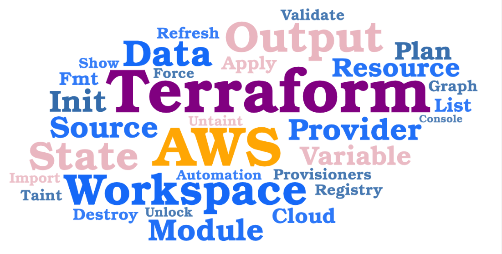

# Terraform

- ### [00-Terraform-Basics](00-Terraform-Basics) - Terraform Definitions and more
- ### [01-Terraform-Installation](01-Terraform-Installation) - Install Terraform

- ### [02-Terraform-Configuration](01-Terraform-Configuration) - Configure Terraform

 

 <h3><a href="03-Terraform-Terminologies/README.md">03-Terraform-Terminologies</a></h3> 

- **Provider** : Define the providers like AWS, Azure, GCP
- **Resource** : Infrastructure Resources to be created, ex: VPC, S3, EC2
- **Data Sources** (optional) : Pull the data from the provider
- **Variable**: Give user option to enter the value for defined resources
- **Arguments** : Inputs
- **Attributes** : Outputs
- **Meta-Arguments** : Terraform specific Inputs ex: count, for_each,depends_on

 

- ### [04-Terraform-Top-Level-Blocks](04-Terraform-Top-Level-Blocks) - Terraform Top Level Blocks
    - **Terraform Block** (>0.13 version) or Terraform Settings Block or Terraform Configuration Block 
    - **Provider Block**
    - **Resource Block**
    - **Input Variables Block**
    - **Output Values Block**
    - **Local Values Block**
    - **Data Sources Block**
    - **Modules Block**

- ### [05-Terraform-Commands](05-Terraform-Commands) - Basic Terraform Commands
    - *`terraform init`*
    - *`terraform validate`*
    - *`terraform plan`*
    - *`terraform apply`* or *`terraform apply -auto-approve`*
    - *`terraform destroy`* or *`terraform destroy -auto-approve`*

- ### [06-Terraform-VPC-Demo](06-Terraform-VPC-Demo) - Simple Demo to Create AWS VPC using Terraform

- ### [07-Terraform-Resources](07-Terraform-Resources) - Understanding Resource behavior
    - ***created***
    - ***destroyed*** 
    - ***updated***

- ### [08-Terraform-Resource-Meta-Arguments](08-Terraform-Resource-Meta-Arguments) - Terraform Meta-Arguments
    1. [***`count`***](08-Terraform-Resource-Meta-Arguments/08-01-count/)
    2. [***`for_each`***](08-Terraform-Resource-Meta-Arguments/08-02-for_each/) 
    3. [***`depends_on`***](08-Terraform-Resource-Meta-Arguments/08-03-depends_on/)
    4. [***`provider`***](08-Terraform-Resource-Meta-Arguments/08-04-provider/) 
    5. [***`lifecycle`***](08-Terraform-Resource-Meta-Arguments/08-05-lifecycle/)

- ### [09-Terraform-Variables](09-Terraform-Variables) - Terraform Variables
    1. [**Terraform Variables with `default` Option**](09-Terraform-Variables/)
    2. [**Overriding `default` Variable values with `-var` Option**](09-Terraform-Variables/)
    3. [**Overriding `default` Variable values with `Environment Variables` Options**](09-Terraform-Variables/)
    4. [**Overriding `default` Variable values with `terraform.tfvars` file**](09-Terraform-Variables/09-01-Terraform-Variables-tfvars/)
    5. [**Overriding `default` Variable values with different `.tfvars` using *`-var-file`* Option**](09-Terraform-Variables/09-02-Terraform-Variables-tfvars-var-file/)
    6. [**Terraform Variables type *list***](09-Terraform-Variables/09-03-Terraform-Variables-list/)
    7. [**Terraform Variables type *map***](09-Terraform-Variables/09-04-Terraform-Variables-map/)

- #### Pending Notes
    - 02-Terraform-Configuration
    - 04-Terraform-Top-Level-Blocks
        - Multiple Providers ( covered in meta argument provider)
     - 05-Terraform-Commands
     - 06-Terraform-VPC-Demo
        - execute the terraform commands to create VPC using vpc.tf and update the command documentation with screenshots     
     - 07-Terraform-Resources
        - Terraform resource behavior for  in place update (add tag) destroy and recreate (change AZ)
    - 08-Terraform-Resource-Meta-Arguments
        - *for_each* for set creating iam user notes

- #### Revise following
    - terraform dependency file ?
    - terraform lock file ?

## Project Work

1.  Create Simple Web Server
    - AWS Components
        - EC2
        - Security Group to allow port 22
        - Security Group to allow port 80, 443
    - Use Terraform variables where ever possible.

 

 <h3><a href="04-Terraform-Top-Level-Blocks/README.md">04-Terraform-Top-Level-Blocks</a></h3> 

- **Terraform Block** (>0.13 version) or Terraform Settings Block or Terraform Configuration Block 
- **Provider Block**
- **Resource Block**
- **Input Variables Block**
- **Output Values Block**
- **Local Values Block**
- **Data Sources Block**
- **Modules Block**

